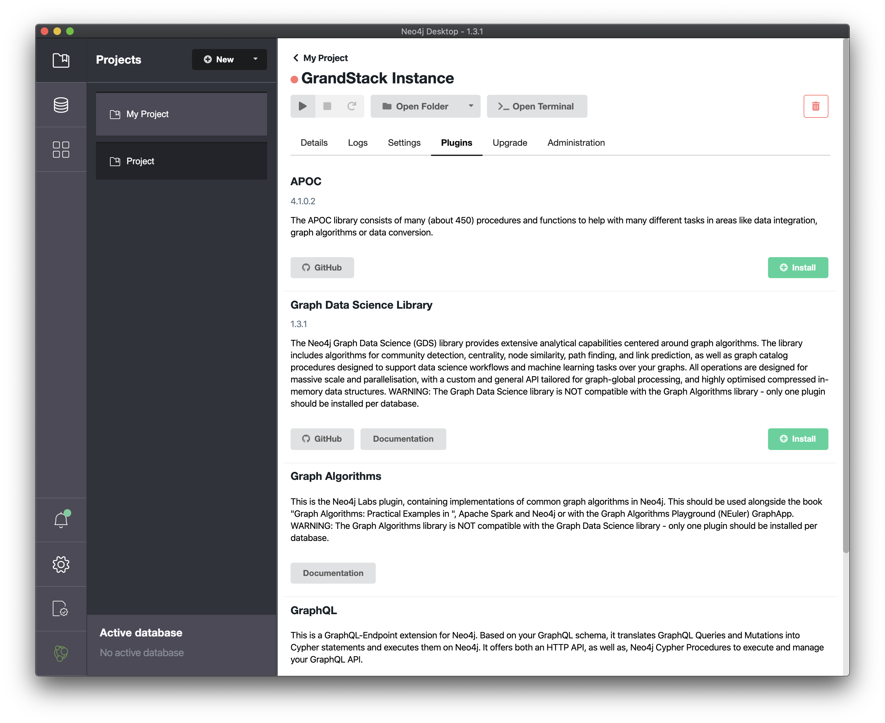

[](https://app.netlify.com/sites/hockey-management-system/deploys)
[](https://www.codefactor.io/repository/github/vladpavlovski/phm)

# HMS - Hockey Management System

Hockey Management System is an app that facilitates and centralizes all aspects of management in a hockey league.

### Database Model

Database model shows all entities and their connections between each other.

You can play with this model simply importing [JSON](./api/HMS_db_model.json) to [playground](https://arrows.app/). [Full size image](img/hms_db_data_model.png).


#### Local Development. Desktop App

You need to install [Neo4j Desktop](https://neo4j.com/download/). Install Neo4j Desktop for your chosen OS and then make a new blank graph for your project. It will require you to put in a password and username. Remember those.

Next you need to go to open the manage screen from the options in the 3 dot stack menu


And install the apoc plugin, green button at the top of the list.



After that you can return to setting up the app with the credentials from the prior steps.

### Install all dependencies

Root folder

```
npm install
```

Front-end folder

```
cd web-react
npm install
```

Back-end folder

```
// back to root folder
cd ..
cd api
npm install
```

## Overview

HMS is a monorepo that includes a GraphQL API application and client web application for React.

### `/` - Project Root

The root directory contains some global configuration and scripts:

- `npm run start` and `npm run build`
- ESLint (.eslintrc.json) for code linting
- Prettier (.prettierrc.json) for code formatting
- Git hooks
- Husky
- Netlify (netlify.toml)

### [`/api`](./api)


This directory contains the GraphQL API application using Apollo Server and @neo4j/graphql.

- Change environment variable settings in `.env`:

```
# Use this file to set environment variables with credentials and configuration options
# This file is provided as an example and should be replaced with your own values
# You probably don't want to check this into version control!

NEO4J_URI=bolt://localhost:7687
NEO4J_USER=neo4j
NEO4J_PASSWORD=letmein
NEO4J_DATABASE=neo4j

# Ask administrator for private keys
AUTH_DIRECTIVES_ROLE_KEY
JWT_SECRET
PRODUCTION_AWS_S3_BUCKET
DEV_AWS_S3_BUCKET

AWS_S3_REGION
AWS_HMS_ACCESS_KEY_ID
AWS_HMS_SECRET_ACCESS_KEY

# Uncomment this line to enable encrypted driver connection for Neo4j
# NEO4J_ENCRYPTED=true

GRAPHQL_SERVER_HOST=0.0.0.0
GRAPHQL_SERVER_PORT=4001
GRAPHQL_SERVER_PATH=/graphql

```

### [`/web-react`](./web-react)

The frontend React web application is found in this directory.

It includes:

- Material UI
- React router
- Apollo Client / React Hooks
- Create React App

- Change environment variable settings in `.env`:

```
# Ask administrator for private keys
REACT_APP_GRAPHQL_URI=/graphql
PROXY=http://localhost:4001/graphql
REACT_APP_STAGE=development
REACT_APP_AUTH0_DOMAIN
REACT_APP_AUTH0_CLIENT_ID
REACT_APP_AUTH0_AUDIENCE
REACT_APP_AUTH0_SCOPE
REACT_APP_X_GRID_KEY

```

## Deployment

### Netlify

This monorepo deployed to Netlify. The frontend application will be served over Netlify's CDN and the GraphQL API will be provisioned as a serverless GraphQL API lambda function deployed to AWS (via Netlify). A netlify.toml file is included with the necessary build configurations.

This project is licensed under the Apache License v2.
Copyright (c) 2022 HMS
